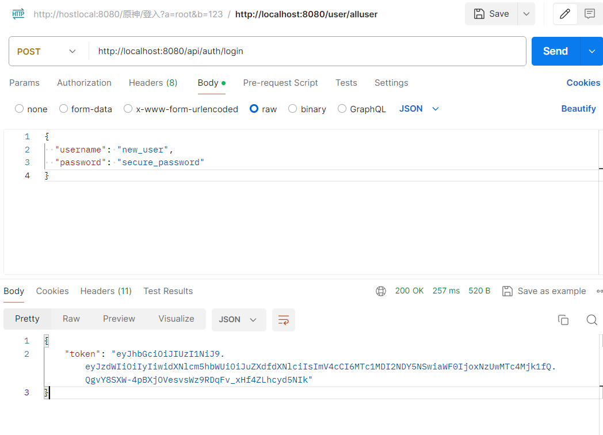
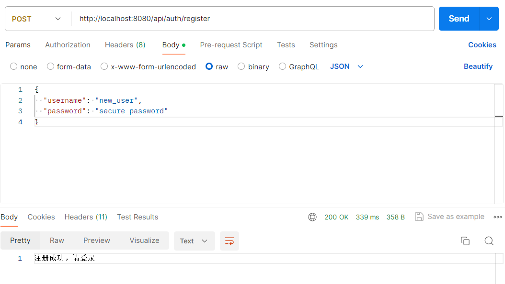
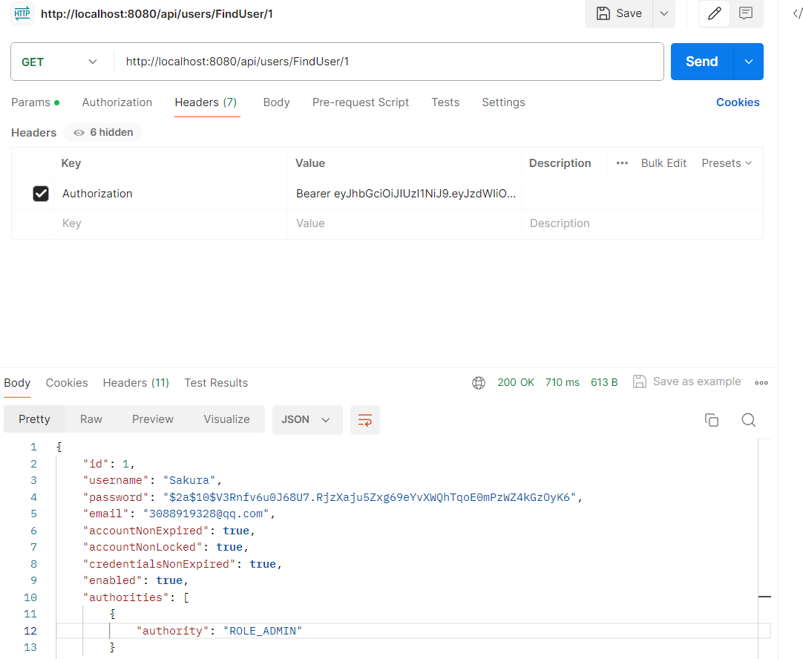
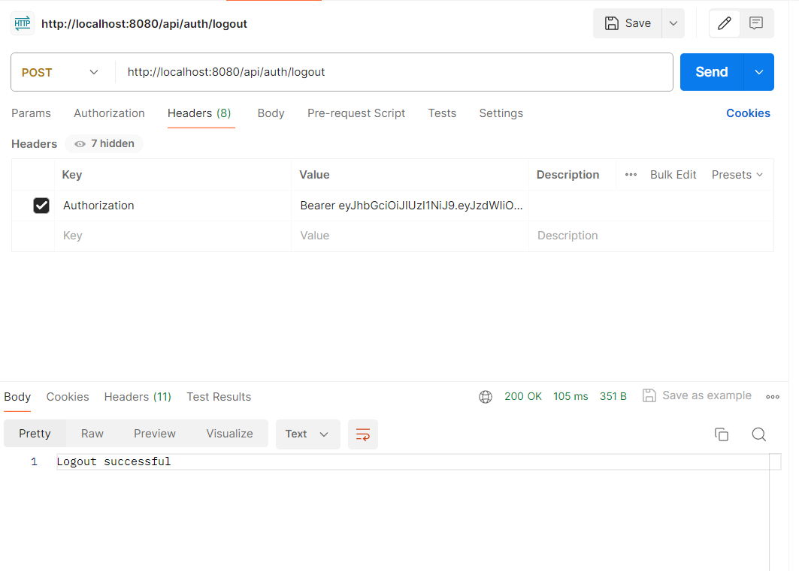

# JWT相关
### JWT（JSON Web Token）是一种开放标准（RFC 7519），用于在网络应用环境间安全地将信息作为JSON对象传输。
### JWT 的核心思想是：客户端在登录后获得一个 token，之后每次请求都携带这个 token 来证明自己的身份，而服务器通过验证 token 来判断用户是否合法。
### JWT 由头信息、声明、以及使用秘密密钥或公钥/私钥对签名的。
## JWT的主要构成部分
* **Header(头部)**：通常由两部分组成：令牌的类型（即JWT）和所使用的签名算法（如HMAC SHA256或RSA）。它被Base64Url编码以形成JWT的第一部分。
* **Payload（负载）**：包含声明。声明是关于实体（通常是用户）和其他数据的声明。同样，这个部分也是Base64Url编码的。
* **Signature（签名）**：要创建签名部分，你**必须获取编码后的header、编码后的payload、一个秘钥（secret）**、以及在header中指定的算法，并对其进行签名。
例如，如果使用的是HMAC SHA256算法，签名创建如下：
  ```
  HMACSHA256(
  base64UrlEncode(header) + "." +
  base64UrlEncode(payload),
  secret)
  ```
### JWT（JSON Web Token）的数据实际上是存储在客户端的，而不是服务器端或数据库中。以下是关于JWT数据存储位置及其如何避免使用数据库查询的一些关键点：
### 客户端存储：一旦生成了JWT，它通常会通过以下几种方式之一存储在客户端：
1. Local Storage 或 Session Storage：在浏览器环境中，可以将JWT存储在这些地方，以便在用户浏览网站的不同页面时保持登录状态。
2. Cookies：另一种常见的做法是将JWT存储在HTTP-only Cookies中，这有助于提高安全性，防止XSS攻击。
3. 移动端应用：对于移动应用程序，可以将其保存在设备的安全存储中。
### 传输机制：
+ 每当客户端需要与服务器通信时（例如发送请求），都会随请求一起发送这个JWT（通常是通过Authorization头部）。服务器接收到这个token后，可以验证其签名并从中提取信息（如用户ID、用户名等），而无需访问数据库。
###
### JWT的设计初衷之一就是为了减轻服务器的负担，减少对数据库的依赖。通过在JWT的payload中包含必要的用户信息，可以在不查询数据库的情况下处理许多请求。具体来说：
1. 身份验证：通过解析JWT中的subject（通常是用户ID或其他唯一标识符），你可以快速识别用户的身份。
2. 权限管理：如果需要，你也可以在JWT中包含用户的权限级别或其他角色信息（作为claims的一部分），这样就可以直接根据这些信息决定是否允许某个操作，而不需要查询数据库来获取用户的权限设置。
3. 减少网络往返：由于所有必要的信息都封装在JWT内，并且每次请求都会附带此token，因此减少了为了获取用户信息而必须进行的额外网络请求。

## *JWT实践*
### JwtUntils (src/main/java/com/ssm/webdbtest/utils/JwtUtils.java) 关键代码
生成token:
``` java
public String generateToken(Long userId, String username) {
        SecretKey key = Keys.hmacShaKeyFor(SECRET_KEY.getBytes());

        return Jwts.builder()
                .setSubject(userId.toString()) // 使用唯一ID作为 subject
                .claim("username", username)   // 把用户名放进额外的 claims
                .setExpiration(new Date(System.currentTimeMillis() + EXPIRATION))
                .setIssuedAt(new Date())
                .signWith(key)
                .compact();
    }
```
+ `Jwts.builder()：` 使用Jwts.builder()来初始化一个新的JWT构建器实例。
+ `.setSubject(username)：`设置JWT的主题（subject），通常用来指定用户的身份标识符，此处使用传入的username。
+ `.setExpiration(new Date(System.currentTimeMillis() + EXPIRATION))：`设置JWT的过期时间。当前时间加上EXPIRATION（应该是以毫秒为单位的时间长度）后得到的日期被设置为过期时间。这意味着在指定时间之后，该token将被视为无效。
+ `.setIssuedAt(new Date())：`设置JWT的签发时间，即当前时间。
+ `.signWith(key)：`指定使用之前创建的key对JWT进行签名。这是确保JWT完整性和不可否认性的重要步骤。签名过程会根据给定的密钥和算法保护JWT中的信息不被篡改。
+ `.compact()：`生成最终的、紧凑的URL安全的字符串形式的JWT。这个方法会把header、payload以及signature组合起来，并返回完整的JWT。

### 使用用户ID作为JWT的subject，同时在JWT的payload中以claim的形式添加用户名以及其他必要的用户信息。保证用户身份的唯一性，方便地访问到用户的相关信息。

### setSubject拓展：
JWT 的 subject 字段用途：在 JWT 的标准声明（claims）中，sub（subject）字段是预定义的字段之一，官方文档 RFC 7519 明确指出：
`The "sub" (subject) claim identifies the principal that is the subject of the JWT.`
翻译为中文就是：“sub 是 JWT 主体的标识”。
通常这个主体是指用户或其他实体，必须是唯一的


### AuthController 实现了一个登录接口
+ 使用 Spring Security 的 AuthenticationManager 来进行用户名/密码验证
+ 验证成功后生成 JWT token
+ 将 token 返回给客户端

调用 authenticate() 方法进行认证，会触发 Spring Security 的认证流程
``` java
Authentication authentication = authenticationManager.authenticate(
        new UsernamePasswordAuthenticationToken(request.getUsername(), request.getPassword())
);
```
这段代码是 用户登录认证流程的核心部分，它完成了从用户输入用户名和密码到生成 JWT Token 的全过程
### MyUserDetailsService 使用userMapper根据用户名查询数据库
+ 注意，在 MyUserDetailsService中，loadUserByUsername方法返回值要满足相关条件，***Spring Security 要求使用 UserDetails 或其子类***，为了与 Spring Security 框架无缝集成，你需要提供一个实现了 UserDetails 接口的对象，自定义的用户类User要实现UserDetails接口
  
+ 如果 User 类没有实现 UserDetails，则需要转换，修改loadUserByUsername返回值

### JwtLoginFilter 登入拦截器

- attemptAuthentication()：尝试认证。
- 成功 → 调用 successfulAuthentication()。
- 失败 → 调用 unsuccessfulAuthentication()。

`attemptAuthentication` 方法 ：这个方法用于从 HTTP 请求中读取登录信息，并尝试进行用户身份验证。

``` java
    @Override
    public Authentication attemptAuthentication(HttpServletRequest request,
                                                HttpServletResponse response)
            throws AuthenticationException, IOException, ServletException {
        try {
            LoginRequest loginRequest = objectMapper.readValue(request.getInputStream(), LoginRequest.class);

            if (loginRequest.getUsername() == null || loginRequest.getPassword() == null) {
                throw new IllegalArgumentException("Username or password is missing");
            }

            return getAuthenticationManager().authenticate(
                    new UsernamePasswordAuthenticationToken(
                            loginRequest.getUsername(),
                            loginRequest.getPassword(),
                            Collections.emptyList()
                    )
            );
        } catch (IOException e) {
            logger.severe("Failed to parse login request: " + e.getMessage());
            throw new RuntimeException("Invalid login request format", e);
        }
    }
```
`successfulAuthentication` 方法 :当用户认证成功后调用此方法，用于生成 JWT（JSON Web Token）并将其返回给客户端。

`unsuccessfulAuthentication` 方法 :当用户认证失败时调用此方法，用于向客户端发送认证失败的通知。

### CustomAuthenticationProvider 验证用户的凭据（通常是用户名和密码），并根据验证结果返回一个认证对象或抛出异常
``` java
    //authenticate() 方法：这是核心认证逻辑。
    //从传入的 Authentication 对象中获取用户名和密码。
    //调用 myuserDetailsService.loadUserByUsername(username) 获取用户详细信息。
    //使用 passwordEncoder.matches(password, userDetails.getPassword()) 检查密码是否匹配。
    //如果匹配成功，创建并返回一个新的 UsernamePasswordAuthenticationToken 对象，包含用户信息和权限。
    //如果不匹配，抛出 BadCredentialsException 异常。
    @Override
    public Authentication authenticate(Authentication authentication) {
        String username = authentication.getName();
        String password = authentication.getCredentials().toString();

        UserDetails userDetails = myuserDetailsService.loadUserByUsername(username);
        if (passwordEncoder.matches(password, userDetails.getPassword())) {
            System.out.print(userDetails.getAuthorities());
            return new UsernamePasswordAuthenticationToken(
                    userDetails,  // ✅ 改为传入整个 userDetails 对象
                    password,     // 原始凭证密码（通常不建议保存明文）
                    userDetails.getAuthorities()
            );
        } else {
            throw new BadCredentialsException("密码错误");
        }
    }
```
### SecurityConfig 配置应用程序的安全性设置
**配置安全策略：**
+ 定义哪些 URL 需要身份验证（authenticated），哪些允许匿名访问（permitAll）。
+ 设置 CSRF 保护、会话管理策略等。

**集成自定义认证逻辑：**
+ 注册自定义的身份验证提供者（如 CustomAuthenticationProvider），以便你可以实现自己的用户认证逻辑。
+ 添加自定义过滤器（如 JwtLoginFilter, JwtRequestFilter）来处理特定的请求路径或执行额外的安全检查。

**管理密码加密：**
+ 提供一个 PasswordEncoder Bean，用于加密和验证用户提供的密码。

**控制会话行为：**
+ 设置会话创建策略为无状态（STATELESS），这在使用 JWT 这样的令牌机制时特别有用，因为不需要服务器端存储会话信息。
``` java
    @Bean
    public SecurityFilterChain securityFilterChain(
            HttpSecurity http,
            JwtLoginFilter jwtLoginFilter,
            JwtRequestFilter jwtRequestFilter,
            RequestMatcher loginRequestMatcher,
            CustomAuthenticationProvider customAuthProvider) throws Exception {
        // 禁用 CSRF（如果你的应用是无状态的，例如 REST API）
        http.csrf(csrf -> csrf.disable())
                //设置了 Session 管理策略为 STATELESS
                .sessionManagement(session -> session
                        .sessionCreationPolicy(SessionCreationPolicy.STATELESS))
                //允许所有人访问 /api/auth/login, /api/auth/register, 和 /api/auth/logout。
                //所有其他请求都需要身份验证。
                .authorizeHttpRequests(auth -> auth
                        .requestMatchers(loginRequestMatcher, registerRequestMatcher(), logoutRequestMatcher())
                        .permitAll()
                        .anyRequest().authenticated())
                // 将 JwtRequestFilter 添加到过滤器链中，在 UsernamePasswordAuthenticationFilter 之前执行。
                .addFilterBefore(jwtRequestFilter, UsernamePasswordAuthenticationFilter.class)
                //将 JwtLoginFilter 替换 UsernamePasswordAuthenticationFilter 在过滤器链中的位置。
                //这意味着对于登录请求，将使用 JwtLoginFilter 来进行处理。
                .addFilterAt(jwtLoginFilter, UsernamePasswordAuthenticationFilter.class);

        return http.build();
    }
```
## 登入测试： 
## 注册测试： 
## 查找测试： 
## 退出测试： 
